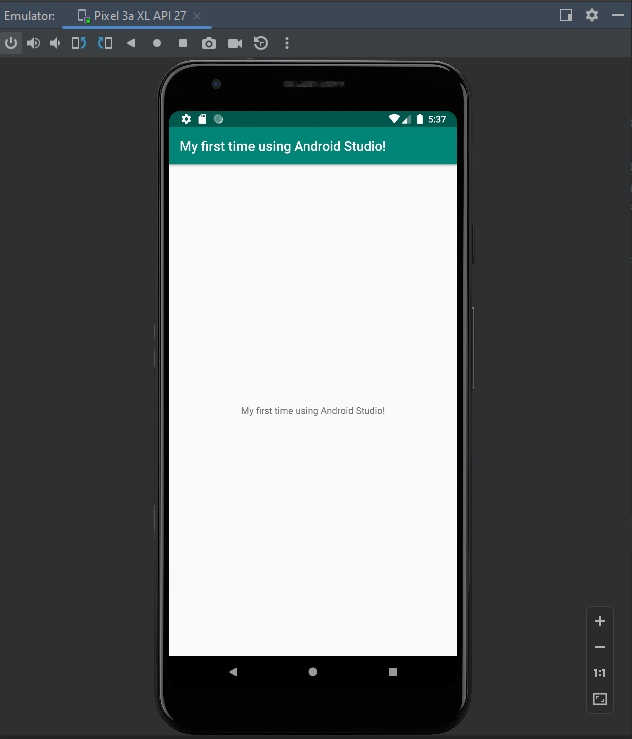

Programmering av mobila applikationer 
Rapport "Hello World"



```
<resources>
    <string name="app_name">My first time using Android Studio!</string>
</resources>

```
För att komma åt värdet som vi vill ändra på så går jag in i App -> Resources -> Values -> Strings. Genom att ändra värdet i strängen "app-name" kan vi istället skriva in något trevligt.
Jag har ändrat värdet från "Hello" till "My first time using Android Studio". För att lägga till mina ändringar i koden klickar jag Commit och anger vilken typ av ändring som gjorts i koden.
Därefter klickar jag på Push för att överföra tillägget i koden till Github. På Github kan man sedan se den uppdaterade koden samt den ändring som gjorts i koden i form av vilken kod som 
tagits bort och vilken kod som lagts till.


